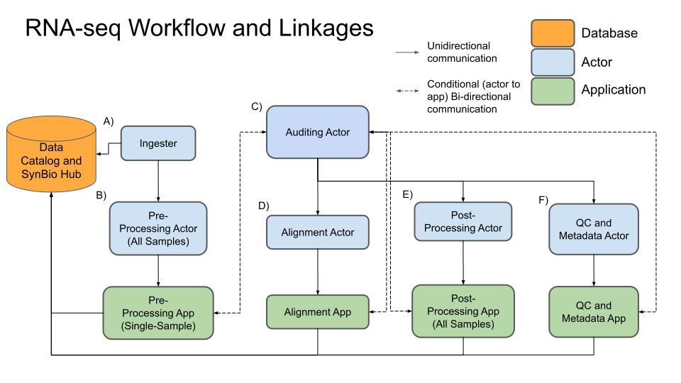

This is the novel-chassis alignment and QC pipeline. It trims paired reads, aligns to a reference genome, annotates aligned reads, aggregates annotated alignments into a dataframe of counts, pulls metadata from the `science_table`, and runs QC metrics which are then appended to the counts dataframes. On overview of the data flow is provided here:



The pipeline is triggered by a metadata upload from the labs, and each step of the analysis has an reactor/app pair. The reactor responds to events and submits jobs to an application, which runs on the HPC cluster, after the application completes it messages the auditing reactor. The auditing reactor checks the integrity of the outputs for individual jobs, resubmitting jobs when necessary, monitoring job status, and handling the order of operations for data processing: for example, all pre-processing and alignment jobs must complete before they can be aggregated into a dataframe. The pipeline is triggered by the [ingest reactor](https://gitlab.sd2e.org/sd2program/copy-s3-directory-reactor), and jobs report out their status to the [pipeline jobs manager](https://gitlab.sd2e.org/sd2program/pipelinejobs-manager) (which in turn writes out job status to the data catalog). For more information about the cyberinfrastructure that these apps and reactors are built on, check out the:
- [TAPIS documentation](https://tacc-cloud.readthedocs.io/projects/agave/en/latest/index.html)
- [SD2E Data Catalog documentation](http://docs.catalog.sd2e.org/en/latest/)
- [Abaco documentation](https://abaco.readthedocs.io/en/latest/), or the [Abaco API Technical Reference](https://tacc.github.io/abaco-live-docs/)

Ignoring all the middleware and error checking (which is the majority of the code here), the actual commands for trimming, alignment, etc. are as follows; first reads are trimmed, see near line 122 [here](https://gitlab.sd2e.org/sd2program/app_rnaseq_preprocessing/blob/master/src/runsortmerna#L122):
```
java -jar ${TRIMMOMATIC_DIR}/trimmomatic-0.36.jar PE -phred33 \
          ${R1} ${R2} ${R1NAME}_trimmed.fastq ${R1NAME}_unpaired.fastq \
          ${R2NAME}_trimmed.fastq ${R2NAME}_unpaired.fastq \
          ILLUMINACLIP:${TRIMMOMATIC_DIR}/adapters/${ADAPTER} \
          LEADING:3 TRAILING:3 SLIDINGWINDOW:4:15 \
          MINLEN:${MINLEN}
```

To learn more about these options and what they mean, please check the [Trimmomatic documentation](http://www.usadellab.org/cms/uploads/supplementary/Trimmomatic/TrimmomaticManual_V0.32.pdf).

There is an optional step which includes running `sortmerna` to remove rRNA from the readmates, but this option is turned off by default in the novel-chassis pipeline. After trimming, the reads are run through FastQC to generate quality scores for each read-mate:
```
${FASTQC_DIR}/fastqc ${R1NAME}_trimmed.fastq &
${FASTQC_DIR}/fastqc ${R2NAME}_trimmed.fastq
```
For more information on interpreting the reports generated by FastQC, check out the individual report guides [here](https://www.bioinformatics.babraham.ac.uk/projects/fastqc/Help/3%20Analysis%20Modules/).


Next, the trimmed reads are passed to the novel_chassis_app for alignment with bwa, see near line 67 [here](https://gitlab.sd2e.org/sd2program/novel_chassis_pipeline/blob/master/novel_chassis_app/src/analysis_pipeline.sh#L67):
```
bwa mem -t 40 ${REF} ${forward} ${reverse} > ${TEMPDIR}/${outsample}.sam
```
For more on the options and commands availavle to bwa, see the [BWA reference guide](http://bio-bwa.sourceforge.net/bwa.shtml).
After alignment with bwa, the resulting sam file is sorted by PICARD tools function `SortSam`, and then `AddOrReplaceGroups` is run on the sorted sam. The final .bam that is used for quantifying gene expression is the `*.RG.bam` (a product of the `AddOrReplaceGroups` function):
```
java ${JAVAOPTS1} -jar ${PICARDDIR} \
      SortSam SORT_ORDER=coordinate \
      INPUT=${TEMPDIR}/${outsample}.sam \
      OUTPUT=${TEMPDIR}/${outsample}.sorted.sam \
      TMP_DIR=${TEMPDIR} VALIDATION_STRINGENCY=LENIENT

java ${JAVAOPTS1} -jar ${PICARDDIR} \
      AddOrReplaceReadGroups \
      ${PICARDOPTS} \
      RGLB=${outsample} \
      RGPL=Illumina \
      RGPU=${outsample} \
      RGSM=${outsample} \
      INPUT=${TEMPDIR}/${outsample}.sorted.sam \
      OUTPUT=${TEMPDIR}/${outsample}.RG.bam
```
This pipeline uses PICARD `2.18.15`, but I've found the GATK documentation to be the most helpful (GATK has since shipped with PICARD tools included), see [here for the GATK Docs](https://software.broadinstitute.org/gatk/documentation/tooldocs/4.0.0.0/picard_sam_AddOrReplaceReadGroups.php).

For DNA-seq analysis I would suggest using the `.indel_cleaned.bam` that is output by the novel-chassis app. The indel_cleaned bam is produced from the RG.bam by using `MarkDuplicates` from PICARD, and the `IndelRealigner` from GATK:
```
java ${JAVAOPTS1} -jar ${PICARDDIR} \
      MarkDuplicates \
      TMP_DIR=${TEMPDIR} \
      VALIDATION_STRINGENCY=LENIENT \
      CREATE_INDEX=TRUE REMOVE_DUPLICATES=FALSE \
      TAG_DUPLICATE_SET_MEMBERS=TRUE \
      CREATE_MD5_FILE=TRUE \
      INPUT=${TEMPDIR}/${outsample}.RG.bam \
      OUTPUT=${TEMPDIR}/${outsample}.aligned.duplicates_marked.bam \
      METRICS_FILE=${TEMPDIR}/${outsample}.duplicate_metrics.txt

java -Djava.io.tmpdir=${TEMPDIR} ${ASIO}=true ${TL}=50 ${HFL}=10 -Xmx5000m -jar ${GATK} \
      -T IndelRealigner -U -R ${REF} \
      -o ${TEMPDIR}/${outsample}.aligned.duplicates_marked.indel_cleaned.bam \
      -I ${TEMPDIR}/${outsample}.aligned.duplicates_marked.bam \
      -compress 1 \
      -targetIntervals ${TARGETS}
```
The novel-chassis-app does try to create .vcf files from this bam file, however it often fails because this version of GATK can not handle non ATGC basepairs in the reference genome (like N's for example). Therefore, if you'd like to generate a VCF, I recommend using the [GATK VCF app](https://gitlab.sd2e.org/sd2program/gatk_vcf_app)(or the [deepvaraint VCF app](https://gitlab.sd2e.org/sd2program/deepvariant_vcf_app)). The GATK app runs the following commands:
```
gatk --java-options "-Xmx4g" HaplotypeCaller \
    -R ${FASTA} \
    -I ${BAM} \
    -O ${OUTNAME}.g.vcf.gz \
    -ERC GVCF

gatk --java-options "-Xmx4g" GenotypeGVCFs \
   -R ${FASTA} \
   -V ${OUTNAME}.g.vcf.gz \
   -O ${OUTNAME}.vcf.gz

gatk --java-options "-Xmx4g" VariantAnnotator \
   -R ${FASTA} \
   -I ${BAM} \
   -V ${OUTNAME}.vcf.gz \
   -O ${OUTNAME}.final_output.vcf \
   -A Coverage
```
And deepvariant is run with:
```
singularity exec ${IMAGE} \
            /opt/deepvariant/bin/run_deepvariant \
            --model_type=${MODEL_TYPE} \
            --ref=${REF} \
            --reads=${BAM} \
            --output_vcf=output.vcf.gz \
            --output_gvcf=output.g.vcf.gz \
            --num_shards=24
```


Ok, so next for RNA-seq is annotating/aggregating counts. All the alignments are aggreagated into a single dataframe by the [RNA-seq postprocessing app](https://gitlab.sd2e.org/sd2program/app_rnaseq_postprocessing/tree/master). A json of `"$SAMPLE_ID": "$FILE_PATH"` is sent to the application along with a .gff annotation. The app uses featureCounts to quantify and aggregate the alignments, see around line 103 [here](https://gitlab.sd2e.org/sd2program/app_rnaseq_postprocessing/blob/master/src/count_features.R#L103):
```
fc <- featureCounts(files=files_location,
      annot.ext=gtf,
      isGTFAnnotationFile=TRUE,
      GTF.featureType="CDS",
      GTF.attrType="Name",
      isPairedEnd=TRUE,
      requireBothEndsMapped=FALSE)
```
More documentation on the `featureCounts` function is available in the [`Rsubread` documentation](https://www.rdocumentation.org/packages/Rsubread/versions/1.22.2/topics/featureCounts). This application also calculates TPM and FPKM counts from the raw counts file generated by `Rsubread` with the following [functions](https://gitlab.sd2e.org/sd2program/app_rnaseq_postprocessing/blob/master/src/count_features.R#L156):
```
fpkm <- function(counts, lengths) {
  pm <- sum(counts) /1e6
  rpm <- counts/pm
  rpm/(lengths/1000)
}

tpm <- function(counts, lengths) {
  rpk <- counts/(lengths/1000)
  coef <- sum(rpk) / 1e6
  rpk/coef
}
```
And the output is six counts dataframes: raw counts, FPKM, TPM, and transposed versions of those three outputs.

Finally we arrive at the QC metadata application, which queries the `science_table` and `jobs` table for metadata, creates groups from the metadata and calculates correlations within groups, and pulls quality metrics out of the log files for preprocessing and alignment. The source code is [here](https://gitlab.sd2e.org/sd2program/novel_chassis_pipeline/tree/master/qc_and_metadata_app/src). The function for calculating correlations is near line 99 [here](https://gitlab.sd2e.org/sd2program/novel_chassis_pipeline/blob/master/qc_and_metadata_app/src/qc_from_raw_counts.py#L99).
